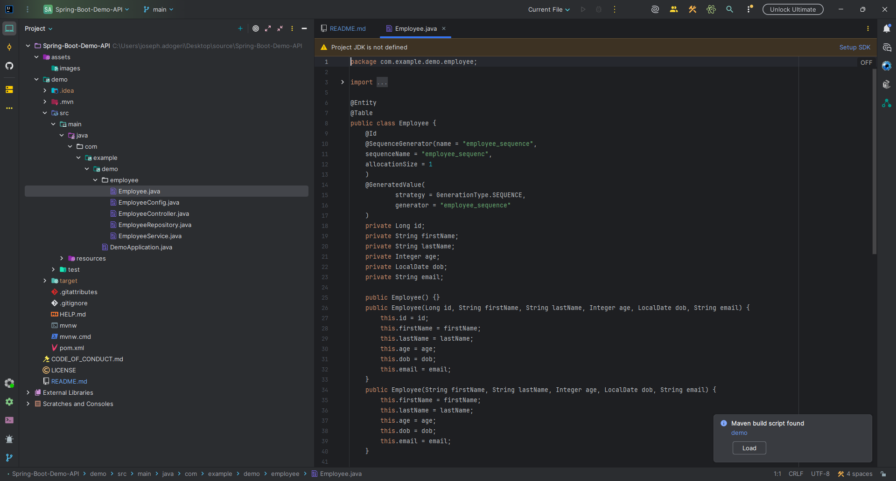
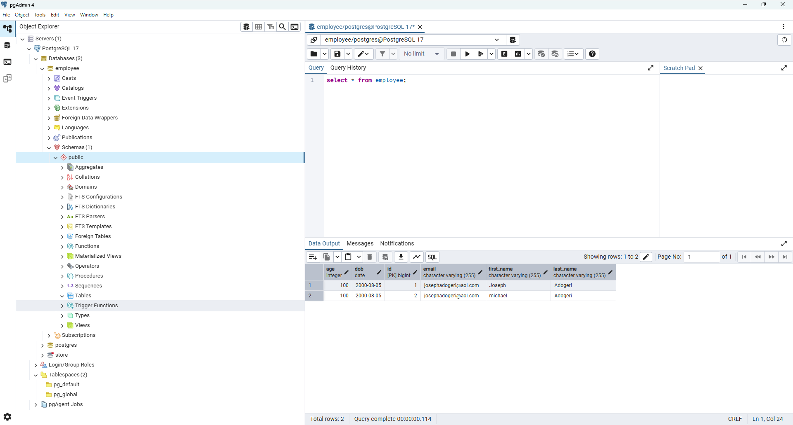
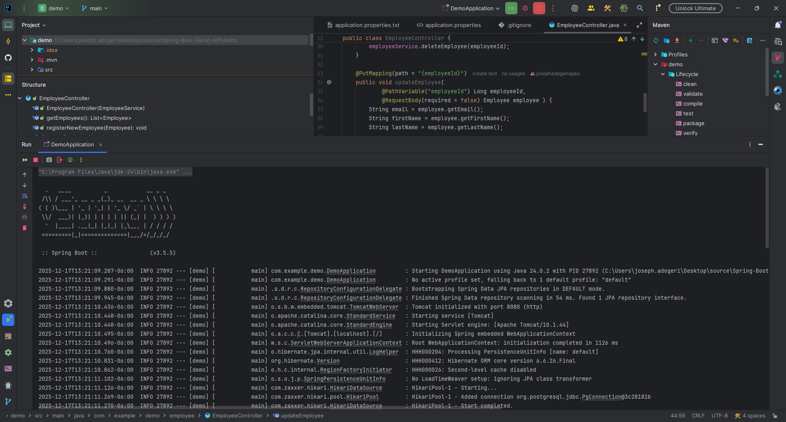
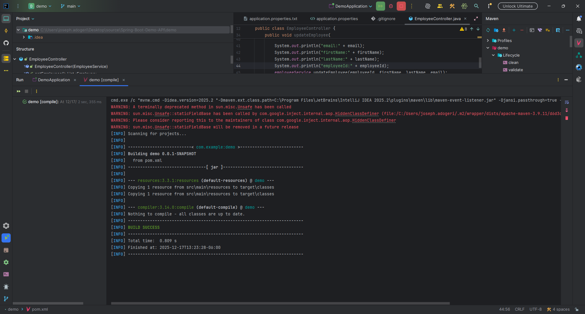

## **Glossy Textured Contact Form**

**Version:** 1.1
**Date:** August 21, 2025

---

## Description

This is a frontend Application temnplate (typescript) utilizing library react hook form for validating inputs.

## Authors

[@jadogeri](https://www.github.com/jadogeri)

## Acknowledgements

Design and template by [W3Layouts](https://w3layouts.com/)

## Project Template

[Glossy Textured Contact Form Responsive Widget Template](https://w3layouts.com/glossy-textured-contact-form-responsive-widget-template/)

## Deployment

Application is deployed in Github (Github Pages)

 [https://jadogeri.github.io/Glossy_Textured_Contact_Form/](https://jadogeri.github.io/Glossy_Textured_Contact_Form/)

## Repository

[source code ](https://github.com/jadogeri/Glossy_Textured_Contact_Form)

## Screenshots
-------------------------------------------------------------------------------------------------
|  |  |
| -------------------------------------------- | -------------------------------------------- |
|  |  |

## Table of Contents

<ul>
    <li><a href="#1-introduction">1. Introduction</a>
        <ul>
            <li><a href="#11-purpose">1.1 Purpose</a> </li>
        </ul>
    </li>
    <li><a href="#5-installation">2. Installation</a> </li>
    <li><a href="#6-usage">3. Usage</a>
        <ul>
            <li><a href="#61-run-application">3.1 Run Application</a> </li>
            <ul>
              <li><a href="#611-run-locally">3.1.1 Run Locally</a> </li>
            </ul>
        </ul>
    </li>
    <li><a href="#10-references">4. References</a> </li>
</ul>


## **1. Introduction**

### **1.1 Purpose**

This document outlines the components, and design considerations for utilizing react hook form for form input validation.

## **2. Installation**

* [Download and install NodeJS](https://nodejs.org/en/download)

---

## **3. Usage**

**Prerequisites** :installation of NodeJS.

### **3.1 Run Application**

1 Open command prompt or terminal.

2 Type command git clone https://github.com/jadogeri/Glossy_Textured_Contact_Form.git then press enter.

```bash
  git clone https://github.com/jadogeri/Glossy_Textured_Contact_Form.git
```

3 Enter command cd Glossy_Textured_Contact_Form then press enter.

```bash
  cd Glossy_Textured_Contact_Form
```

#### **3.1.1 Run Locally**

1 Type npm install --force to install dependencies.

```bash
  npm install --force
```

2 Type npm start to run application

```bash
  npm start
```
---

## **4. References**

* FreeCodeCamp : [Frontend Web Development: (HTML, CSS, JavaScript, TypeScript, React)](https://www.youtube.com/watch?v=MsnQ5uepIa).
* AweSome Open Source : [Awesome Readme Templates](https://awesomeopensource.com/project/elangosundar/awesome-README-templates)
* Readme.so : [The easiest way to create a README](https://readme.so/)
* HUXN Webdev : [Master ReactJS in 7 Hours with 10 Real-World Projects 2023](https://www.youtube.com/watch?v=XrwsMN2IWnE/)
* Dave Gray : [React JS Full Course for Beginners | Complete All-in-One Tutorial | 9 Hours](https://www.youtube.com/watch?v=RVFAyFWO4go/)
* Dipesh Malvia : [Learn React JS with Project in 2 Hours | React Tutorial for Beginners | React Project Crash Course](https://www.youtube.com/watch?v=0riHps91AzE/)